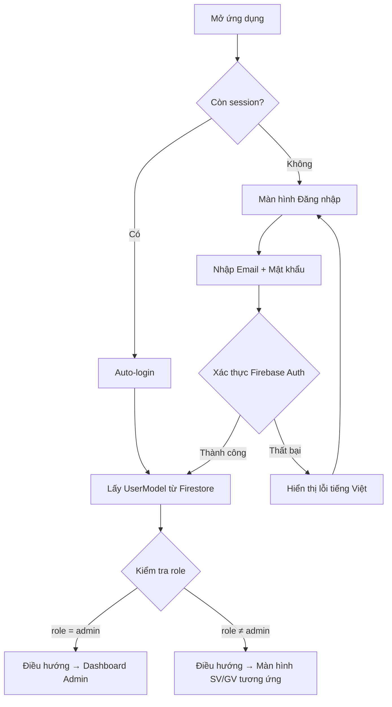
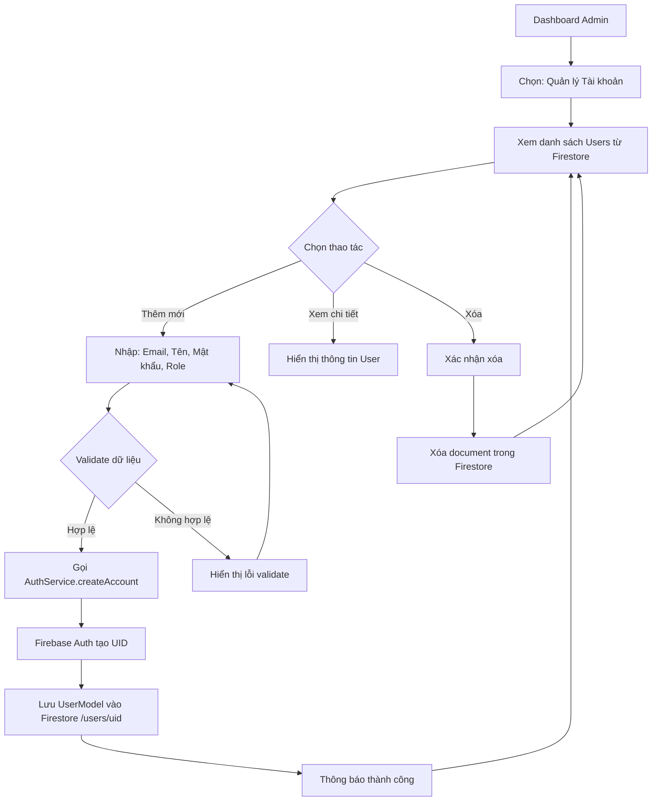
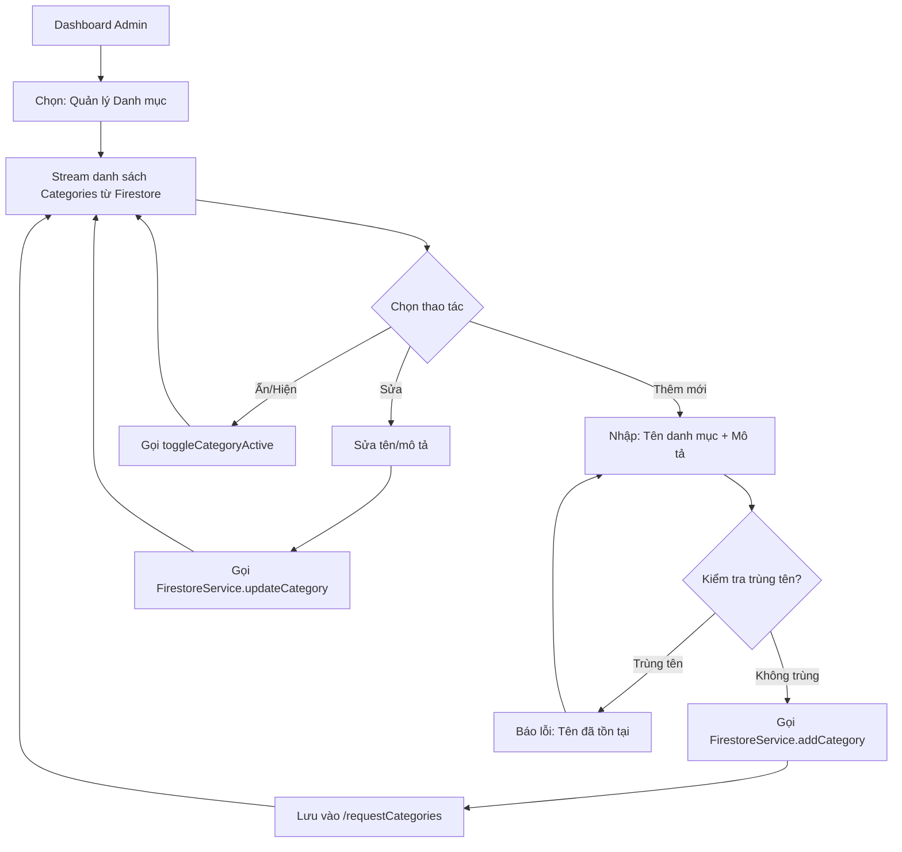
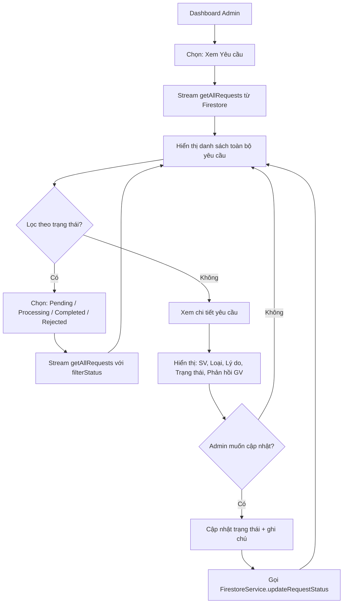
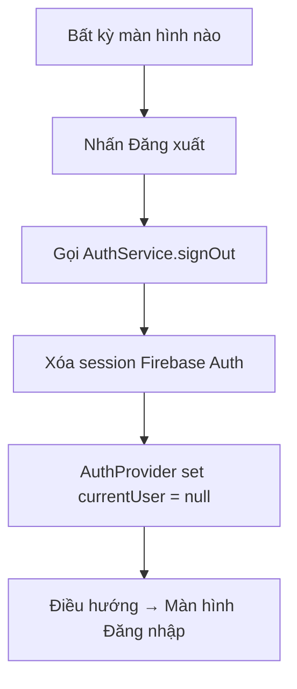
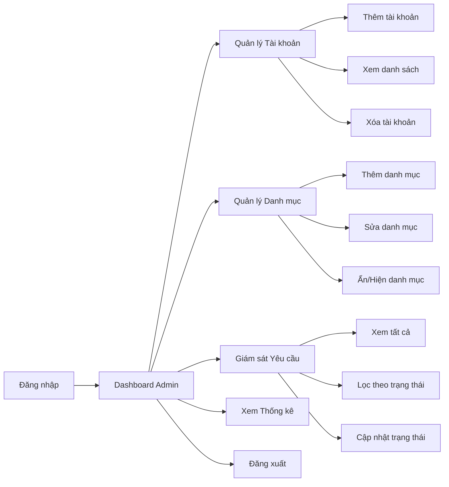

# Sơ đồ luồng Admin — HDPE (Task 1.2)
> **TV2 phụ trách** — Thiết kế luồng hoạt động của Admin trong hệ thống xử lý yêu cầu sinh viên.

---

## 1. Tổng quan vai trò Admin

Admin là người quản trị toàn bộ hệ thống, có quyền:
- Quản lý tài khoản người dùng (Sinh viên, Giáo vụ)
- Quản lý danh mục yêu cầu
- Giám sát toàn bộ yêu cầu trong hệ thống
- Xem thống kê, báo cáo

---

## 2. Luồng đăng nhập Admin

---

## 3. Luồng quản lý tài khoản (Admin)

---

## 4. Luồng quản lý danh mục yêu cầu (Admin)

---

## 5. Luồng giám sát yêu cầu (Admin)

---

## 6. Luồng đăng xuất

---

## 7. Tổng quan luồng Admin đầy đủ

