# Sơ đồ Cơ sở dữ liệu (ERD) — HDPE (Task 1.2 & 2.2)
> **TV2 phụ trách** — Thiết kế cấu trúc Database Firebase/Firestore cho hệ thống xử lý yêu cầu sinh viên.

---

## 1. Sơ đồ quan hệ thực thể (ERD)

```mermaid
erDiagram
    USERS {
        string uid PK "ID từ Firebase Auth"
        string email "Email đăng nhập"
        string displayName "Họ tên hiển thị"
        string role "student | staff | admin"
        string studentId "Mã SV (chỉ role=student)"
        string fcmToken "Token Push Notification"
        timestamp createdAt "Ngày tạo tài khoản"
    }
    
    REQUEST_CATEGORIES {
        string categoryId PK "Auto-generated"
        string name "Tên danh mục"
        string description "Mô tả chi tiết"
        boolean isActive "true = hiển thị cho SV"
        timestamp createdAt "Ngày tạo"
    }
    
    REQUESTS {
        string requestId PK "Auto-generated"
        string studentUid FK "UID sinh viên tạo"
        string studentName "Họ tên SV"
        string studentId "Mã số SV"
        string categoryId FK "ID danh mục"
        string categoryName "Tên danh mục (denormalized)"
        string reason "Lý do / nội dung yêu cầu"
        array attachmentUrls "Mảng URL ảnh đính kèm"
        string status "pending | processing | completed | rejected"
        string note "Phản hồi của Giáo vụ"
        string staffUid FK "UID cán bộ xử lý"
        timestamp createdAt "Ngày tạo yêu cầu"
        timestamp updatedAt "Ngày cập nhật cuối"
    }

    USERS ||--o{ REQUESTS : "Sinh viên tạo yêu cầu"
    USERS ||--o{ REQUESTS : "Giáo vụ xử lý yêu cầu"
    REQUEST_CATEGORIES ||--o{ REQUESTS : "Phân loại theo danh mục"
```



---

## 2. Cấu trúc Firestore Collections

```
Firestore Root
├── users/                        ← Tài khoản người dùng
│   └── {uid}/
│       ├── uid: string
│       ├── email: string
│       ├── displayName: string
│       ├── role: "student" | "staff" | "admin"
│       ├── studentId: string?    ← Mã SV (chỉ role=student)
│       ├── fcmToken: string?     ← Token gửi Push Notification
│       └── createdAt: timestamp
│
├── requestCategories/            ← Danh mục yêu cầu (Admin quản lý)
│   └── {categoryId}/
│       ├── name: string          ← VD: "Xin bảng điểm"
│       ├── description: string
│       ├── isActive: boolean     ← false = ẩn khỏi SV
│       └── createdAt: timestamp
│
└── requests/                     ← Yêu cầu của sinh viên
    └── {requestId}/
        ├── studentUid: string    ← UID của SV tạo yêu cầu
        ├── studentName: string
        ├── studentId: string     ← Mã số SV
        ├── categoryId: string
        ├── categoryName: string
        ├── reason: string        ← Lý do/nội dung yêu cầu
        ├── attachmentUrls: []    ← Mảng URL ảnh đính kèm
        ├── status: "pending" | "processing" | "completed" | "rejected"
        ├── note: string?         ← Phản hồi của Giáo vụ
        ├── staffUid: string?     ← UID cán bộ xử lý
        ├── createdAt: timestamp
        └── updatedAt: timestamp
```

---

## 3. Giải thích thiết kế

### Tại sao dùng NoSQL (Firestore) thay vì SQL?
- **Real-time sync**: Firestore hỗ trợ stream dữ liệu real-time, phù hợp để SV theo dõi trạng thái yêu cầu ngay lập tức.
- **Serverless**: Không cần thuê/quản lý server, giảm chi phí cho dự án sinh viên.
- **Tích hợp Firebase Auth**: Dùng chung UID giữa Auth và Firestore, đơn giản hóa phân quyền.

### Denormalization (categoryName trong requests)
- Lưu `categoryName` trực tiếp trong document `requests` thay vì chỉ lưu `categoryId` rồi join.
- **Lý do**: Firestore không hỗ trợ JOIN. Denormalize giúp giảm số lần đọc, tăng tốc hiển thị danh sách yêu cầu.

### Security Rules
- Xem chi tiết tại file `/firestore.rules`
- Sinh viên chỉ đọc yêu cầu của chính mình
- Chỉ Giáo vụ/Admin mới được cập nhật trạng thái
- Không ai được xóa yêu cầu (chỉ archive)

---

## 4. Indexes cần tạo trên Firebase Console

| Collection | Fields | Order | Mục đích |
|------------|--------|-------|----------|
| requests | studentUid, createdAt | ASC, DESC | UC004: SV xem yêu cầu của mình |
| requests | status, createdAt | ASC, ASC | UC005: GV xem yêu cầu pending (FIFO) |
| requestCategories | isActive, name | ASC, ASC | Lấy danh mục active theo tên |
